# 유희준 (UHeeJoon)

**Backend Engineer · Java / Spring**

장애를 사전에 발견하고 **구조로 해결**하는 데 강점이 있는 백엔드 개발자입니다.
온프레미스 인증 시스템의 클라우드 SaaS 전환 프로젝트에 초기 설계부터 참여해 **가용성 · 성능 · 신뢰성**을 담당했습니다.

---

## 주요 경험

- **가용성** — Redis 단일 인스턴스 장애가 전 고객사 로그인 마비로 이어지는 리스크를 선제 식별하고, Circuit Breaker + DB Fallback 자가 복구 구조로 *서비스 중단 0건* 달성
- **성능** — `EXPLAIN ANALYZE`로 Full Table Scan을 추적하고 pg_trgm(GIN) 인덱스로 검색 API를 *987ms → 20ms (97%↓)* 개선
- **신뢰성** — SQS 멱등 키 + DLQ로 로그·결제 파이프라인의 *중복·유실 0건* 처리

---

## 회고

실무에서 깊이 다루지 못해 아쉬웠던 주제들을 도메인 단위로 정리하고, 개인적으로 파보고 싶었던 것들을 딥다이브하며 기록하고 있습니다.

- Zero Trust 인증/인가, 분산 환경에서의 데이터 정합성 등 실무 경험을 이론으로 다시 정리
- 관심 기술을 직접 구현해보며 동작 원리 파악

> [기술 블로그](https://codding-til-theory.tistory.com)에 학습 기록을 남기고 있습니다.

---

## Tech Stack

**Backend**

**Data**

**Infra & DevOps**

-326CE5?style=flat-square&logo=kubernetes&logoColor=white)

---

## Projects

### Team
**Team**

**Personal**

---

## GitHub & PS

---

## Education

- **한신대학교** 정보통신학부 (2019.03 – 2025.02)
- **코리아 IT 아카데미** Java/Spring 웹개발 · SQLD 과정
